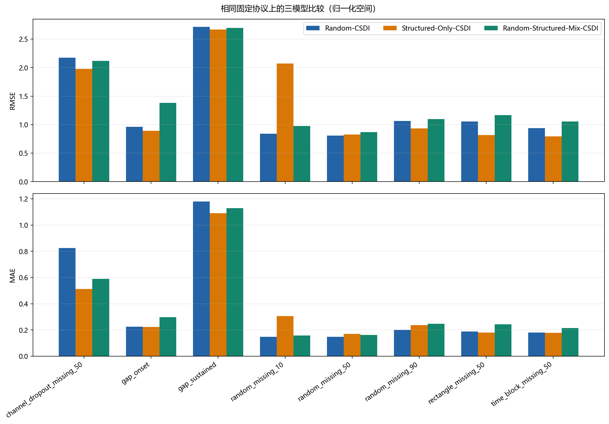

# ESA Mission 1 Random–Structured Mix CSDI 实验报告

## 实验口径

每个训练窗口以 `50%` 概率使用随机散点遮盖；其余窗口在连续时间块、整窗通道块和通道–时间矩形块之间按配置概率选择。该实验是 Random–Structured Mix，不是论文原版 Historical Mix。模型固定训练到第 32,000 步，不使用测试集选模。

## Mix-CSDI headline

| 协议 | 类型 | 严重度 | 目标点 | RMSE | MAE | CRPS |
|---|---|---:|---:|---:|---:|---:|
| channel_dropout_missing_10 | 整窗通道块 | 10% | 98,304 | 1.042155 | 0.500633 | 0.410829 |
| channel_dropout_missing_50 | 整窗通道块 | 50% | 466,944 | 2.117049 | 0.590456 | 0.501311 |
| channel_dropout_missing_90 | 整窗通道块 | 90% | 835,584 | 2.330879 | 0.678443 | 0.570183 |
| random_missing_10 | 随机散点 | 10% | 93,440 | 0.976881 | 0.157410 | 0.125888 |
| random_missing_50 | 随机散点 | 50% | 466,944 | 0.870845 | 0.162406 | 0.128492 |
| random_missing_90 | 随机散点 | 90% | 840,448 | 1.098750 | 0.247259 | 0.205103 |
| gap_onset | 训练通信中断型压力测试 | onset | 319,488 | 1.381429 | 0.297346 | 0.235667 |
| gap_sustained | 训练通信中断型压力测试 | sustained | 638,976 | 2.695672 | 1.128900 | 0.939557 |
| rectangle_missing_10 | 通道–时间块 | 10% | 92,160 | 0.864328 | 0.177500 | 0.141655 |
| rectangle_missing_50 | 通道–时间块 | 50% | 470,016 | 1.167110 | 0.242430 | 0.203300 |
| rectangle_missing_90 | 通道–时间块 | 90% | 838,656 | 1.317849 | 0.300614 | 0.253000 |
| time_block_missing_10 | 连续时间块 | 10% | 97,280 | 0.616162 | 0.159545 | 0.126206 |
| time_block_missing_50 | 连续时间块 | 50% | 466,944 | 1.057774 | 0.215200 | 0.169682 |
| time_block_missing_90 | 连续时间块 | 90% | 836,608 | 1.278445 | 0.277206 | 0.231527 |

## 与 Random / Structured-Only 的固定协议比较

正改进率表示 Mix-CSDI 的 RMSE 更低。

| 协议 | Random RMSE | Structured RMSE | Mix RMSE | Mix vs Random | Mix vs Structured |
|---|---:|---:|---:|---:|---:|
| channel_dropout_missing_10 | — | 0.906341 | 1.042155 | — | -14.98% |
| channel_dropout_missing_50 | 2.172570 | 1.978066 | 2.117049 | 2.56% | -7.03% |
| channel_dropout_missing_90 | — | 2.320613 | 2.330879 | — | -0.44% |
| gap_onset | 0.963543 | 0.891046 | 1.381429 | -43.37% | -55.03% |
| gap_sustained | 2.715754 | 2.666739 | 2.695672 | 0.74% | -1.08% |
| random_missing_10 | 0.839451 | 2.073964 | 0.976881 | -16.37% | 52.90% |
| random_missing_50 | 0.810406 | 0.825030 | 0.870845 | -7.46% | -5.55% |
| random_missing_90 | 1.062845 | 0.935758 | 1.098750 | -3.38% | -17.42% |
| rectangle_missing_10 | — | 1.006940 | 0.864328 | — | 14.16% |
| rectangle_missing_50 | 1.054588 | 0.816301 | 1.167110 | -10.67% | -42.98% |
| rectangle_missing_90 | — | 0.962023 | 1.317849 | — | -36.99% |
| time_block_missing_10 | — | 1.450326 | 0.616162 | — | 57.52% |
| time_block_missing_50 | 0.937357 | 0.795218 | 1.057774 | -12.85% | -33.02% |
| time_block_missing_90 | — | 0.908272 | 1.278445 | — | -40.76% |

## 解释限制

- 当前配置只有 seed=1；最终论文结论需要多个训练种子。
- 输入为 76 个遥测通道，不包含 11 条高优先级 telecommand。
- anomaly/rare event 保留为观测及潜在目标；communication gap 和非有限值作为自然缺失。
- gap 协议是从训练段通信中断构造的测试压力场景，测试段本身没有自然 gap 事件。
- CRPS 基于每窗 50 个生成样本，只与相同采样数实验比较。
