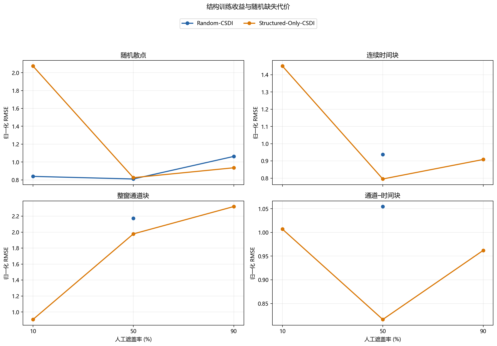
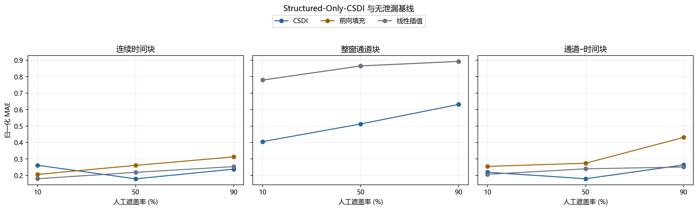
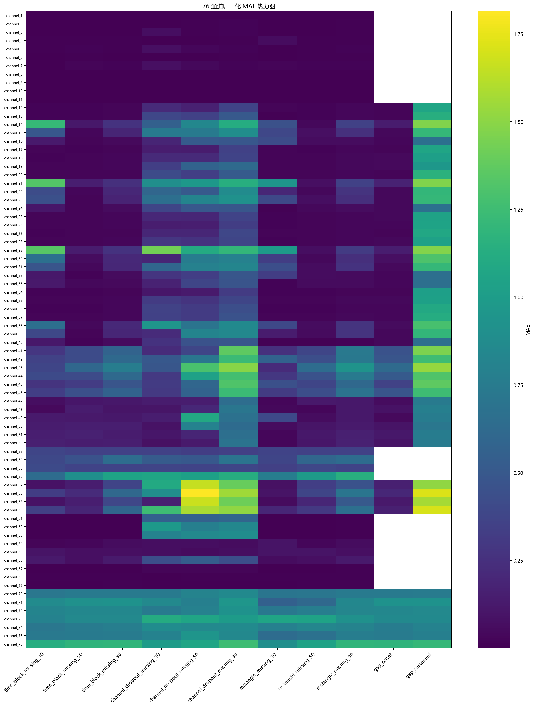
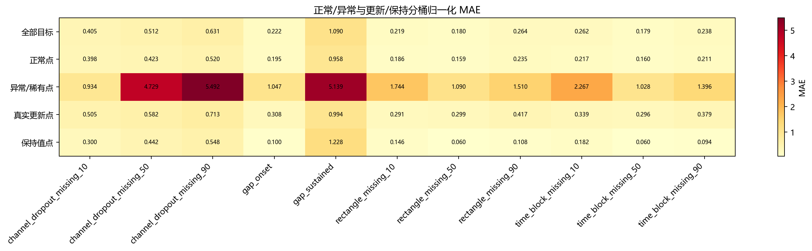
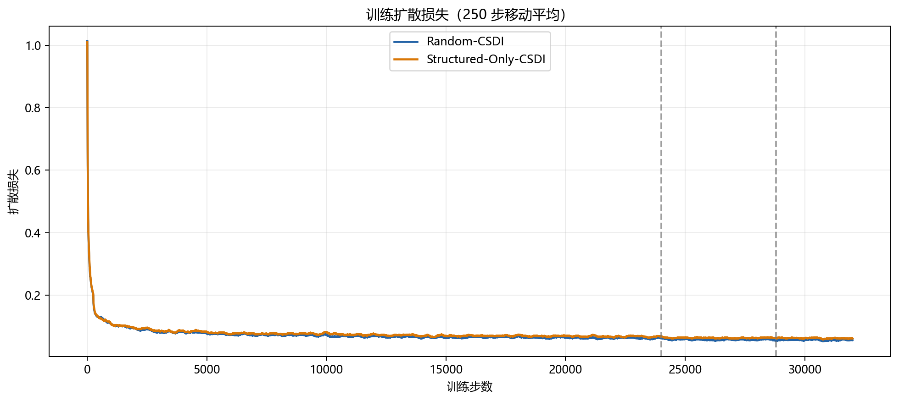

# ESA Mission 1 CSDI 纯结构性遮盖实验报告

## 实验口径

Structured-Only-CSDI 的训练目标全部由连续时间块、整窗通道块和通道–时间块产生，三类等概率，严重度从 0.1–0.9 连续均匀抽取；训练中不使用随机散点遮盖。随机 10%/50%/90% 只用于测试结构训练的泛化代价。模型固定使用第 32,000 步检查点，不使用测试集选模。

## Structured-Only-CSDI headline

| 遮盖协议 | 类型 | 严重度 | 目标点 | RMSE | MAE | CRPS |
|---|---|---:|---:|---:|---:|---:|
| channel_dropout_missing_10 | 整窗通道块 | 10% | 98,304 | 0.906341 | 0.405494 | 0.335353 |
| channel_dropout_missing_50 | 整窗通道块 | 50% | 466,944 | 1.978066 | 0.512495 | 0.434959 |
| channel_dropout_missing_90 | 整窗通道块 | 90% | 835,584 | 2.320613 | 0.631406 | 0.533555 |
| random_missing_10 | 随机散点 | 10% | 93,440 | 2.073964 | 0.306911 | 0.244432 |
| random_missing_50 | 随机散点 | 50% | 466,944 | 0.825030 | 0.169802 | 0.134226 |
| random_missing_90 | 随机散点 | 90% | 840,448 | 0.935758 | 0.236993 | 0.191763 |
| gap_onset | 真实通信中断型 | onset | 319,488 | 0.891046 | 0.222394 | 0.168272 |
| gap_sustained | 真实通信中断型 | sustained | 638,976 | 2.666739 | 1.090486 | 0.931942 |
| rectangle_missing_10 | 通道–时间块 | 10% | 92,160 | 1.006940 | 0.219475 | 0.181440 |
| rectangle_missing_50 | 通道–时间块 | 50% | 470,016 | 0.816301 | 0.179806 | 0.145224 |
| rectangle_missing_90 | 通道–时间块 | 90% | 838,656 | 0.962023 | 0.263882 | 0.214242 |
| time_block_missing_10 | 连续时间块 | 10% | 97,280 | 1.450326 | 0.261721 | 0.207842 |
| time_block_missing_50 | 连续时间块 | 50% | 466,944 | 0.795218 | 0.179426 | 0.138512 |
| time_block_missing_90 | 连续时间块 | 90% | 836,608 | 0.908272 | 0.238136 | 0.193870 |

## 结构收益与随机缺失代价

正改进率表示 Structured-Only-CSDI 的误差更低；负值表示纯结构训练带来退化。

| 协议 | 解释 | Random RMSE | Structured RMSE | RMSE 改进率 |
|---|---|---:|---:|---:|
| channel_dropout_missing_50 | 结构训练收益 | 2.172570 | 1.978066 | 8.95% |
| gap_onset | 结构训练收益 | 0.963543 | 0.891046 | 7.52% |
| gap_sustained | 结构训练收益 | 2.715754 | 2.666739 | 1.80% |
| random_missing_10 | 随机缺失代价 | 0.839451 | 2.073964 | -147.06% |
| random_missing_50 | 随机缺失代价 | 0.810406 | 0.825030 | -1.80% |
| random_missing_90 | 随机缺失代价 | 1.062845 | 0.935758 | 11.96% |
| rectangle_missing_50 | 结构训练收益 | 1.054588 | 0.816301 | 22.60% |
| time_block_missing_50 | 结构训练收益 | 0.937357 | 0.795218 | 15.16% |

## 图表

## 解释限制

- 输入为 76 个遥测通道，不包含 ESA-ADB 官方输入中的 11 条高优先级 telecommand。
- 通道 4–11 的原始尺度指标处于差分空间，不能与其余通道的原值空间误差直接汇总解释。
- anomaly/rare event 保留为观测及潜在目标；communication gap 和非有限值作为自然缺失，不计入人工目标。
- 真实 gap 压力测试只使用训练段 4 次事件得到的 52 通道集合，没有读取测试标签。
- CRPS 基于每窗 50 个生成样本，只与相同采样数的实验直接比较。
